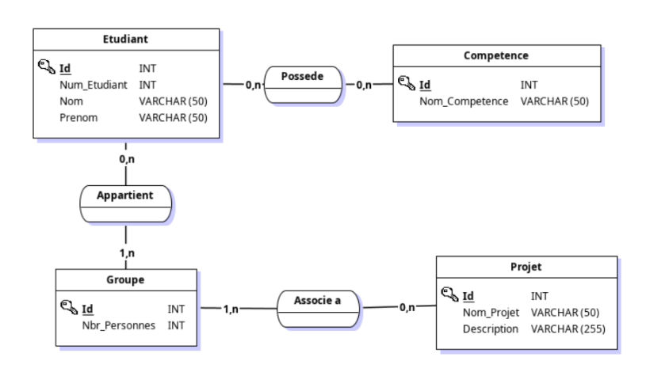

# Workshop Architecture Logicielle 

## Description du projet : 

Ce projet consiste à construire un site web dynamique complet à l’aide de la création d’un serveur capable de stocker une liste d’étudiants et d’y associer des compétences. Il sera également possible de créer des groupes de projets affichant les atouts de l’équipe. Pour cela, nous allons utiliser divers outils, langages et concepts.

Pour les outils, nous utiliserons Flask et un serveur de base de données. Les langages seront diversifiés, permettant de faire du back (Python, SQL) et du front (HTML, CSS, Javascript), ainsi qu’un langage de stockage de données permettant de faire le lien entre l’ensemble (Json).

Les notions clés de ce projet sont les concepts de serveur web, pages dynamiques, templates, MVC, API, REST. 

## Organisation de l’équipe : 

Dans un premier temps, nous avons créé le git pour pouvoir gérer le projet.
De plus, le MCD étant nécessaire pour la suite nous l’avons réalisé ensemble pour être sur d’avoir la même base pour notre projet. Suite à cela, nous avons créé cette base de données via python. On gère ensuite la gestion de base des éléments et réaliser des associations.

## MCD : 

