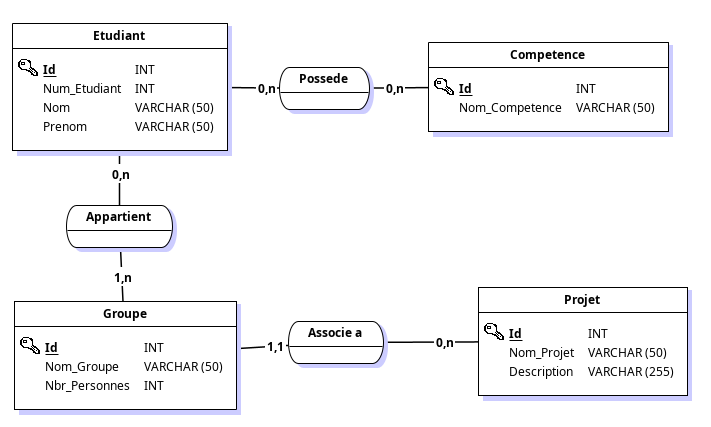

# Workshop Architecture Logicielle 

## Auteurs
Stacey Codjia, Alice Jacques, Claire Gobert

#### Nom du Groupe / Projet 
__Backpack__

#### Lien github
https://github.com/StaceyCodjia/WorkshopArchiS2

## Description du projet : 

Ce projet consiste à construire un site web dynamique complet à l’aide de la création d’un serveur capable de stocker une liste d’étudiants et d’y associer des compétences. Il sera également possible de créer des groupes de projets affichant les atouts de l’équipe. Pour cela, nous allons utiliser divers outils, langages et concepts.

Pour les outils, nous utiliserons Flask et un serveur de base de données. Les langages seront diversifiés, permettant de faire du back (Python, SQL) et du front (HTML, CSS, Javascript), ainsi qu’un langage de stockage de données permettant de faire le lien entre l’ensemble (Json).

Les notions clés de ce projet sont les concepts de serveur web, pages dynamiques, templates, MVC, API, REST. 

## Organisation de l’équipe : 

Dans un premier temps, nous avons créé le git pour pouvoir gérer le projet.
De plus, le MCD étant nécessaire pour la suite nous l’avons réalisé ensemble pour être sur d’avoir la même base pour notre projet. Suite à cela, nous avons créé cette base de données sur le mysqul commun via python. On gère ensuite la gestion de base des éléments (liste, ajout, suppression, modification) et réaliser des associations.

## V1 : Topo organisation de l'équipe et répartition du travail 

Nous nous sommes réparties les différentes associations concernant les étudiants, compétences, projets et groupes. 

- Claire : a crée la structure REST globale et l'a appliqué pour la création, modification, suppression, gestion des étudiants et des compétences. A optimisé d'autres parties du code. A également géré les relations entre les tables.

- Alice : a réutilisé le principe de la structure REST pour la création, modification, suppression, gestion des projets (et en partie des compétences).

- Stacey : a réutilisé le principe de la structure REST pour la création, modification, suppression, gestion des groupes. 

## MCD : 

## Schéma :

Etudiant(<u>Id</u>, Num_Etudiant, Nom, Prenom)
Competence(<u>Id</u>, Nom_Competence)
Possede(<u>#Etudiant_Id, #Competence_Id</u>)
Groupe(<u>Id</u>, Nom_Gropue, Nbr_Personnes, #Projet_Id)
Appartient(<u>#Etudiant_Id, #Groupe_Id</u>)
Projet(<u>Id</u>, Nom_Projet, Description)

## Liste des endpoints

#### Étudiants
`GET /`
Affiche la page d’accueil (liste des étudiants via JS)
`GET /etudiant/new`
Formulaire d’ajout d’un étudiant
`GET /etudiant/edit/<int:id>`
Formulaire de modification d’un étudiant
`GET /api/etudiants`
Retourne la liste des étudiants (JSON)
`GET /api/etudiant/<int:id>`
Retourne un étudiant (JSON)
`POST /api/etudiant`
Crée un nouvel étudiant (JSON)
`PUT /api/etudiant/<int:id>/edit`
Modifie un étudiant (JSON)
`DELETE /api/etudiant/<int:id>/delete`
Supprime un étudiant

#### Compétences
`POST /api/competence`
Ajoute une compétence (si utilisé)

#### Projets
`GET /projects`
Affiche la page des projets
`GET /project/edit/<int:id>`
Formulaire de modification d’un projet
`GET /api/projects`
Retourne la liste des projets (JSON)
`POST /api/project`
Crée un projet
`PUT /api/project/<int:id>/edit`
Modifie un projet
`DELETE /api/project/<int:id>/delete`
Supprime un projet

#### Groupes
`GET /groups`
Affiche la page des groupes
`GET /group/edit/<int:id>`
Formulaire de modification d’un groupe
`GET /api/groups`
Retourne la liste des groupes (JSON)
`POST /api/group`
Crée un groupe
`PUT /api/group/<int:id>/edit`
Modifie un groupe
`DELETE /api/group/<int:id>/delete`
Supprime un groupe